<h1> Mise en oeuvre de l'injection des dépendances</h1>

<h2>Interface IDao</h2>
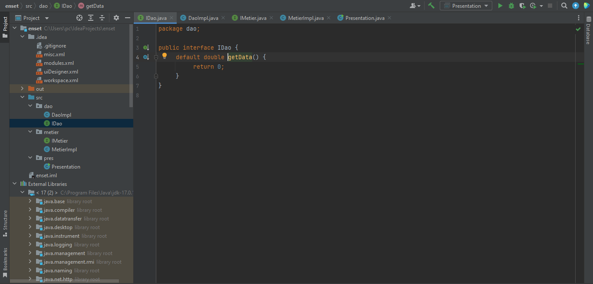
<h2>Classe Dao </h2>
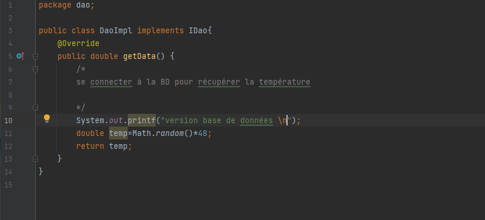
<h2>Interface Imetier</h2>
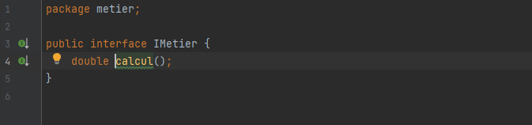
<h2>Classe MetierImpl </h2>
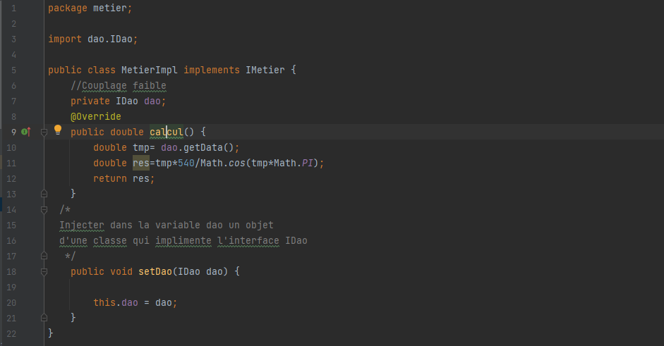
<h2>Classe Presentation </h2>
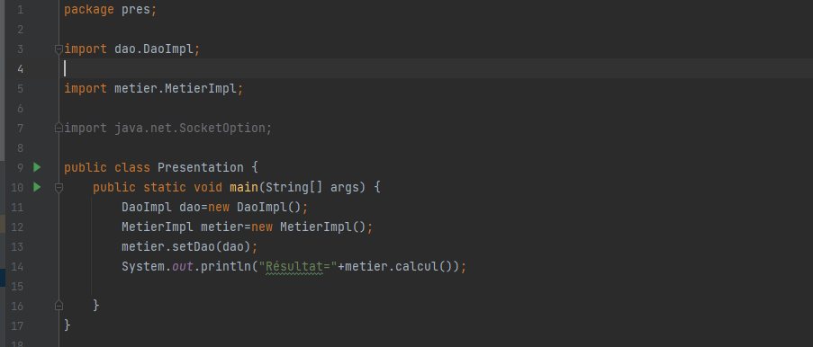
<h2>Exécution</h2>
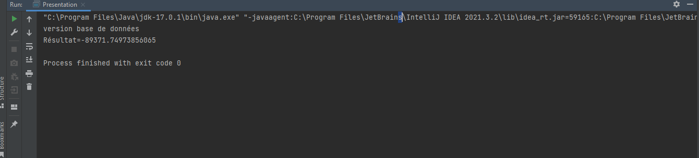
<h2>La version capteurs</h2>
<h3>Injection des dépendances par
instanciation  statique => new</h2>
<h3>La création de la nouvelle classe DaoImpl2</h3>
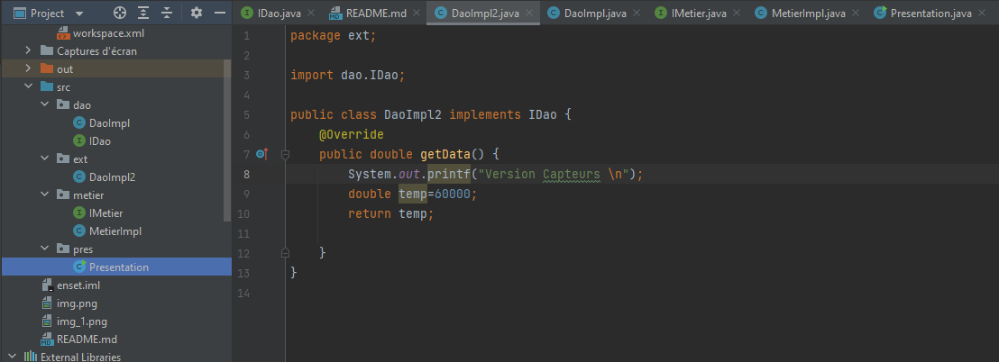
<h3>L'exécution de la version capteurs</h3>
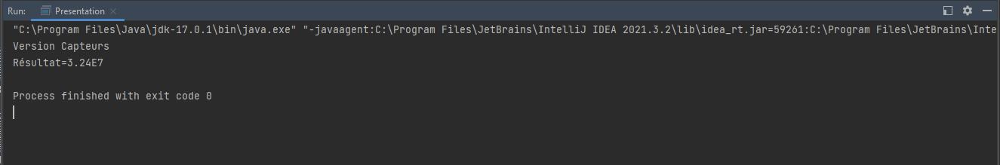
<h3>La création de fichier de configuration </h3>
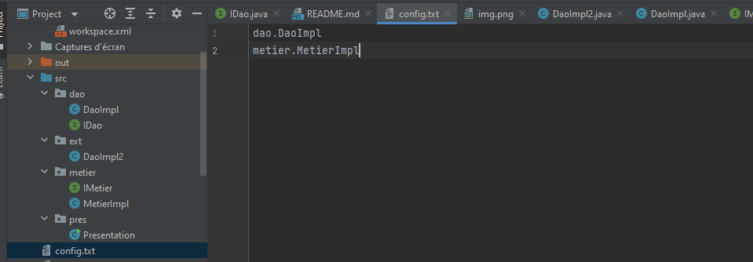
<h3>Injection des dépendances par
instanciation  dynamique=> new</h3>
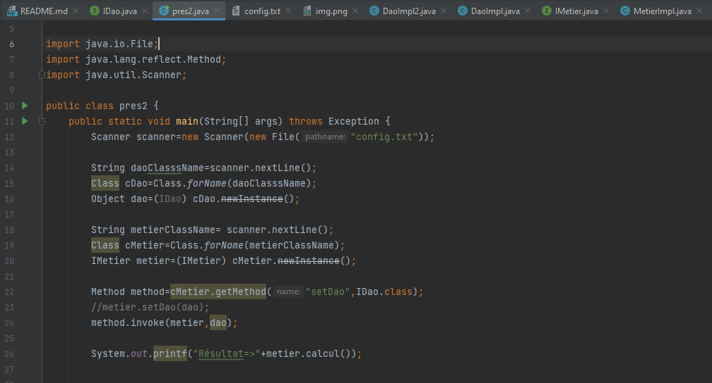
<h2>Exécution de la version base de données</h2>
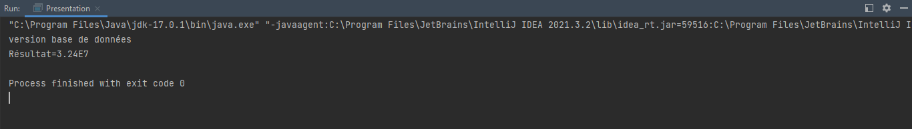
<h2>La classe DaoImplVWS</h2>
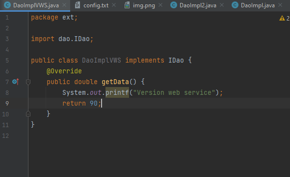
<h2>Exécution de la version web</h2>
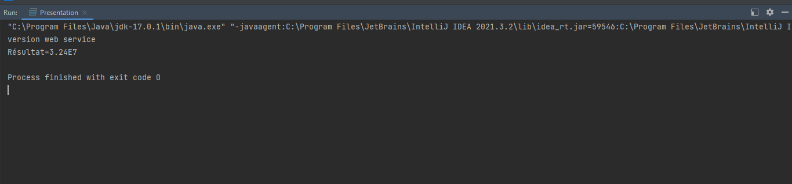

